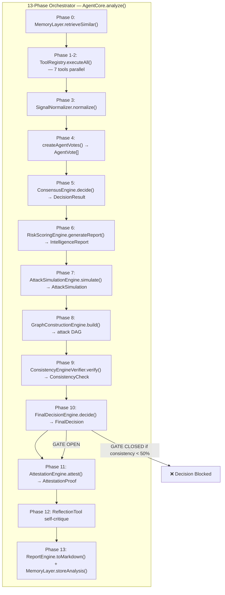

# RAXC — Autonomous Exploit Intelligence Core

> **A deterministic multi-agent orchestrator that scans smart contracts for vulnerabilities, simulates attacks, cryptographically proves every result, and writes immutable encrypted audit reports on-chain on Mantle Sepolia. No LLM override. No hallucinations. Verifiable forever.**

[](./backend)
[](./contracts)
[](./backend/Dockerfile)
[](https://raxclaw-mantle.vercel.app)
[](https://youtu.be/KCB8SH8YXvo)

---

## 🎥 Demo Video

[](https://youtu.be/i7NuIjf5wck)

---

## The Problem, The Gap, The Solution


```
DEFI EXPLOIT LOSSES BY YEAR

2017  $30M     ▏
2018  $140M    ▍
2020  $20M     ▏
2021  $124M    ▍
2022  $206M    ▌
2023  $444M    ▋
2024  $1.4B    ██████▌
2025  $1.8B    █████████ ← Worst year ever

474 confirmed exploits · $4.1B total · $11.2M average per incident
```

### 🔴 The Problem
DeFi protocols are bleeding. In 2025 alone, exploits stole 1.8 billion dollars across the ecosystem. Traditional audits cost $10-50K per contract, take weeks, and rely entirely on human review — one missed line means millions lost.

### 🟡 The Gap
AI-powered security scanners exist, but they're mostly ChatGPT wrappers. A single LLM hallucinates findings, can't prove its results, and leaves zero permanent record. You're trusting a black box with user funds. That's not security — that's gambling.

### 🟢 The Solution — RAXC
RAXC is not an LLM. It's a **deterministic orchestrator** — 8 parallel analysis tools feed into a consensus engine, a consistency gatekeeper blocks invalid decisions, and every result is cryptographically proved with a replay ID and trace hash. The full audit report is written permanently on-chain (AES-256-GCM + ECIES encrypted) on Mantle Sepolia. Same input, same output, every time. Verifiable forever.

---

### ⚔️ Not Just Another Auditor

RAXC is not a ChatGPT wrapper. It's a **sovereign execution engine** with a deterministic 13-phase pipeline:

- **8 analysis tools** run in parallel — static analysis, RAG semantic search, access control, flash loan detection
- **Consensus Engine** aggregates weighted votes — the LLM is just one input, not the authority
- **Attack Simulator** generates VM-like execution paths with state transitions and graph-bound steps
- **Consistency Gatekeeper** blocks any decision where simulation, graph, and tool signals don't align
- **Confidence Engine** is the SINGLE SOURCE OF TRUTH — no module computes confidence independently
- **Final Decision Engine** is the SINGLE AUTHORITY — tools, agents, and LLMs CANNOT override it
- **Attestation Engine** produces a cryptographic replay ID + execution trace hash for every audit
- **On-chain proof** written to RaxcAgentERC8004 on Mantle Sepolia — immutable, verifiable, permanent. Single contract combining audit records + long-context memory. Reports are ECIES-encrypted — only the contract owner can decrypt them.

The result? Every audit comes with a **replay ID** and **trace hash** that prove the exact same input always produces the exact same output. No black box. No trust required.

---

## 🔗 Live Deployments

| Service | URL |
|---|---|
| **Frontend** | [raxclaw-mantle.vercel.app](https://raxclaw-mantle.vercel.app) |
| **WebSocket API** | `wss://raxclaw-mantle.fly.dev/ws` |
| **RaxcAgentERC8004** | [0x28d8317b60f5103516c83b40c20d29E8EcB286f1](https://sepolia.mantlescan.xyz/address/0x28d8317b60f5103516c83b40c20d29E8EcB286f1) |

### 🔐 Latest On-Chain Proof

| Field | Link |
|---|---|
| **Memory TX** | [0x6b208d958365cb56292e20fa7bc5f665c32dfffd7c39b387bc199bd2f7948ec8](https://sepolia.mantlescan.xyz/tx/0x6b208d958365cb56292e20fa7bc5f665c32dfffd7c39b387bc199bd2f7948ec8) |
| **Audit TX** | [0x8240ee5f25e4340eaacd05f4c79369df428db94aef3704e342e121451207e913](https://sepolia.mantlescan.xyz/tx/0x8240ee5f25e4340eaacd05f4c79369df428db94aef3704e342e121451207e913) |
| **Full Report** | [raxclaw-mantle.vercel.app/tx-report/0x8240ee5f25e4340eaacd05f4c79369df428db94aef3704e342e121451207e913](https://raxclaw-mantle.vercel.app/tx-report/0x8240ee5f25e4340eaacd05f4c79369df428db94aef3704e342e121451207e913) |

---

## Architecture

```
┌─────────────────────────────────────────────────────────────────────┐
│                        raxclaw CLI (Ink/React)                      │
│            run │ analyze │ list │ show │ agent │ health             │
└─────────────────────────────────┬───────────────────────────────────┘
                                  │ spawns
                                  ▼
┌─────────────────────────────────────────────────────────────────────┐
│                      skills/raxc-security/run.sh                    │
│               (all env baked in — zero-config for users)            │
└─────────────────────────────────┬───────────────────────────────────┘
                                  │ exec
                                  ▼
┌─────────────────────────────────────────────────────────────────────┐
│              backend/examples/agent-example.ts                      │
│                  RAXC Cognition Engine (TypeScript)                 │
│                                                                     │
│  1. loadEnv()              Load baked config                        │
│  2. QdrantStorageClient    Query 782 exploits via HNSW (<10ms)      │
│  3. buildOpenAiClient()    OpenAI GPT-4o-mini endpoint              │
│  4. AgentCore::new()       Assemble multi-tool agent                │
│     ├─ RaxcAnalyzer        RAG semantic similarity                  │
│     ├─ RaxcAnalyzerRemote  Secondary RAG confirmation               │
│     ├─ PatternDetectorTool CEI / reentrancy patterns                │
│     ├─ GasAnalyzerTool     Gas griefing vectors                     │
│     ├─ FlashLoanTool       Flash loan attack paths                  │
│     ├─ AccessControlTool   Owner / role checks                      │
│     ├─ ReflectionTool      Self-review loop (OpenAI critique)       │
│     └─ MemoryTool          Persistent cognition memory              │
│  5. Parallel execution     All 8 tools run concurrently             │
│  6. SignalNormalizer       Filter noise, lock precision             │
│  7. ConsensusEngine        Weighted multi-agent voting              │
│  8. AttackSimulationEngine VM-like exploit execution                │
│  9. GraphConstructionEngine Deterministic attack DAG                │
│  10. ConsistencyEngine     Gatekeeper — blocks invalid decisions    │
│  11. ConfidenceEngine      SINGLE SOURCE OF TRUTH                   │
│  12. FinalDecisionEngine   SINGLE AUTHORITY — no LLM override       │
│  13. AttestationEngine     Cryptographic replay ID + trace hash     │
│  14. MemoryLayer           Store result to on-chain contract       │
└─────────────────────────────────┬───────────────────────────────────┘
                                  │
              ┌───────────────────┴──────────────────────┐
              ▼                                          ▼
┌───────────────────────────────┐   ┌─────────────────────────────────┐
│       Mantle Sepolia          │   │          Qdrant Cloud           │
│         (Chain 5003)          │   │  (782 exploits, 2 collections)  │
│                               │   │                                 │
│    RaxcAgentERC8004 (Solidity)│   │      HNSW-indexed search        │
│   0x28d831... audit + memory  │   │       cosine similarity         │
│                               │   │                                 │
│   ECIES-encrypted reports     │   │  defi_cases + defi_protocols    │
│   owner-only decryptable      │   │      68fe2ddf.cloud.qdrant      │
└───────────────────────────────┘   └─────────────────────────────────┘
```

> **RAG Knowledge Base**: The 782 exploit vectors in Qdrant are sourced from
> [DeFiHackLabs](https://github.com/SunWeb3Sec/DeFiHackLabs) and
> [DeFiVulnLabs](https://github.com/SunWeb3Sec/DeFiVulnLabs) —
> the most comprehensive open-source repositories of DeFi exploit
> reproductions and vulnerability labs, maintained by [SunWeb3Sec](https://github.com/SunWeb3Sec).

---

## How It Works — 13-Phase Pipeline

```
Phase 0  → Load on-chain memory (past audits from Mantle Sepolia)
Phase 1  → Dispatch 7 analysis tools in parallel
Phase 2  → Normalize tool signals (filter noise, enforce precision)
Phase 3  → Multi-agent reasoning (convert signals to agent votes)
Phase 4  → Consensus engine (weighted voting aggregation)
Phase 5  → Risk intelligence scoring (severity × confidence × agreement)
Phase 6  → Attack simulation (VM-like execution path generation)
Phase 7  → Graph construction (deterministic attack DAG)
Phase 8  → Consistency verification (4-way gatekeeper)
Phase 9  → Final decision (SINGLE AUTHORITY — no override)
Phase 10 → Attestation proof (cryptographic replay ID + trace hash)
Phase 11 → LLM explanation (GPT-4o-mini, constrained to 2-3 sentences)
Phase 12 → Markdown report + on-chain storage (RaxcAgentERC8004)
```

### 7 Analysis Tools

| Tool | Detects | Trust Weight |
|---|---|---|
| `RaxcAnalyzerRemote` | RAG-based exploit matching (Qdrant + OpenAI) | 1.0x |
| `PatternDetectorTool` | Reentrancy, delegatecall, tx.origin, overflow | 0.8x |
| `FlashLoanTool` | Flash loan callbacks, spot price oracles | 0.7x |
| `AccessControlTool` | Missing `onlyOwner`, unprotected initializers | 0.7x |
| `ReflectionTool` | LLM self-critique (CONFIRMED/REDUCED/REJECTED) | 0.7x |
| `MemoryTool` | Past audit recall from on-chain storage | 0.7x |
| `GasAnalyzerTool` | Gas optimizations (non-security) | 0.2x |

---

## Orchestrator Engine Architecture

RAXC is built as a **deterministic multi-agent orchestrator** — every component is a specialized engine that feeds into the next, forming a single verifiable audit pipeline with no LLM override.



### Core Classes (agent.ts — 2,016 lines)

| Class | Role | Key Method |
|---|---|---|
| `ToolRegistry` | Pluggable tool system | `register()` / `executeAll()` |
| `SignalNormalizer` | Filters noise, locks precision | `normalize()` / `lockConfidence()` |
| `SeverityLock` | Deterministic severity mapping | `enforce()` |
| `ConsensusEngine` | Weighted multi-agent voting | `decide()` → `DecisionResult` |
| `RiskScoringEngine` | Risk formula: 0.35×severity + 0.25×confidence + 0.2×agreement + 0.2×similarity | `calculate()` / `generateReport()` |
| `AttackSimulationEngine` | 4 simulation types (Reentrancy, AccessControl, FlashLoan, Generic) | `simulate()` |
| `GraphConstructionEngine` | Deterministic attack DAG | `build()` |
| `ConsistencyEngineVerifier` | **4-way gatekeeper** — blocks invalid decisions | `verify()` → `ConsistencyCheck` |
| `ConfidenceEngine` | **SINGLE SOURCE OF TRUTH** for confidence | `calculate()` |
| `FinalDecisionEngine` | **SINGLE AUTHORITY** — no LLM/tool override | `decide()` → `FinalDecision` |
| `AttestationEngine` | Cryptographic proof + replay | `attest()` → `AttestationProof` |
| `ReportEngine` | Markdown with 17 standardized sections | `toMarkdown()` |
| `MemoryLayer` | On-chain Mantle persistence | `storeAnalysis()` / `retrieveSimilar()` |
| `AgentCore` | **13-phase orchestration** | `analyze()` |

### Key Interfaces

| Interface | Purpose |
|---|---|
| `Tool` | Contract for pluggable analysis tools: `name()` + `execute()` |
| `ToolSignal` | Structured ground truth: `vulnerability`, `severity`, `confidence`, `evidence` |
| `AgentVote` | Multi-agent vote: `agentName`, `vulnerability`, `confidence`, `reasoning` |
| `DecisionResult` | Consensus output: `vulnerabilityFound`, `primaryVulnerability`, `riskLevel`, `confidence` |
| `IntelligenceReport` | Risk scoring output: `riskScore`, `exploitabilityScore`, `toolAgreement`, `attackLikelihood` |
| `AttackSimulation` | Complete attack model: `executionPath`, `stateTransitions`, `attackerModel`, `exploitVerdict` |
| `FinalDecision` | Single authority output: `finalVerdict`, `finalConfidence`, `finalRiskScore` |
| `AttestationProof` | Verifiable proof: `replayId`, `seed`, `executionTraceHash`, `timestamp` |
| `AnalysisResult` | Complete audit output: decision + signals + simulation + graph + attestation + markdown |

### Authority Chain

```
ToolRegistry (pluggable)      → Raw signals
        ↓
SignalNormalizer              → Filtered signals
        ↓
ConsensusEngine               → DecisionResult
        ↓
RiskScoringEngine             → IntelligenceReport
        ↓
AttackSimulationEngine        → AttackSimulation
        ↓
GraphConstructionEngine       → Attack DAG
        ↓
ConsistencyEngineVerifier     → GATEKEEPER (blocks if score < 50%)
        ↓
ConfidenceEngine              → SINGLE SOURCE OF TRUTH
        ↓
FinalDecisionEngine           → SINGLE AUTHORITY (no LLM override)
        ↓
AttestationEngine             → Cryptographic proof
        ↓
ReportEngine + MemoryLayer    → Markdown + On-chain storage
```

❌ **NO module can override `FinalDecisionEngine`** — not tools, not agents, not LLMs.  
✅ **Every execution is deterministic** — same input always produces same output, replay ID, and trace hash.

---

## On-Chain Contract — RaxcAgentERC8004 (Solidity + Foundry on Mantle Sepolia)

> A single Solidity contract combining audit records and long-context memory, deployed on Mantle Sepolia (Chain 5003). Reports are AES-256-GCM encrypted with an ECIES-encrypted key — only the contract owner can decrypt them.

### Audit Records

```solidity
function createAudit(string contractName) → uint256 recordId
function finalizeAuditEncrypted(uint256 recordId, uint8 riskLevel, uint64 confidence,
                                 string vulnType, bytes encryptedReport, bytes encryptedAesKey)
function reportData(uint256 recordId) → bytes
function recordCount() → uint256
```

### Long-Context Memory

```solidity
function pushMemory(bytes summaryJson, string description)
function memoryData(uint256 index) → bytes
function memoryCount() → uint256
```

### Access Control

```solidity
function isEncrypted(uint256 recordId) → bool
function getEncryptedKey(uint256 recordId) → bytes
function verifyOwner(address claimed, bytes32 messageHash, bytes signature) → bool
```

Risk levels: `0=None | 1=Low | 2=Medium | 3=High | 4=Critical`

---

## Project Structure

```
raxclaw-mantle/
├── contracts/                 # Solidity + Foundry
│   ├── src/
│   │   └── RaxcAgentERC8004.sol  # Single contract: audit + memory
│   ├── script/
│   │   └── DeployRaxcAgentERC8004.s.sol
│   ├── test/
│   │   └── RaxcAgentERC8004.t.sol
│   ├── foundry.toml
│   └── lib/forge-std/
│
├── backend/                   # TypeScript WebSocket server + agent framework
│   ├── src/
│   │   ├── agent.ts           # AgentCore, 13 engines, ReportEngine
│   │   ├── tools.ts           # 7 analysis tools
│   │   ├── openai-client.ts   # GPT-4o-mini interface
│   │   ├── qdrant-storage.ts  # Qdrant HNSW vector search
│   │   ├── mantle-client.ts   # viem-based contract client (ECIES encrypt/decrypt)
│   │   ├── index.ts           # Embedding + RAG pipeline
│   │   └── bin/
│   │       ├── ws-server.ts   # WebSocket server (Hono + Bun)
│   │       └── ws-client.ts   # WebSocket CLI client
│   ├── examples/
│   │   └── agent-example.ts   # Standalone CLI example
│   ├── Dockerfile
│   ├── docker-compose.yml
│   └── .env.example
│
├── frontend/                  # Next.js frontend
│   ├── app/
│   │   ├── page.tsx           # Landing page
│   │   ├── api/report/[id]/   # Decrypt API endpoint
│   │   └── tx-report/[hash]/  # Per-transaction audit viewer
│   ├── components/            # React components
│   └── lib/contracts.ts       # Contract config + event log queries
│
└── reports/                   # Generated audit reports
```

---

## Quick Start

### Prerequisites

- [Bun](https://bun.sh) ≥ 1.2
- [Docker](https://docker.com) (optional, for deployment)
- API keys: OpenAI, Qdrant Cloud
- Mantle Sepolia wallet with MNT (for on-chain proofs)

### 1. Configure Environment

```bash
cd backend
cp .env.example .env
# Edit .env with your keys
```

### 2. Run Locally

```bash
# Install deps
bun install

# Standalone CLI analysis
bun run examples/agent-example.ts

# Start WebSocket server
bun run src/bin/ws-server.ts

# Connect with client (separate terminal)
bun run src/bin/ws-client.ts
```

### 3. Docker Deployment

```bash
docker compose up -d          # Start server
docker compose logs -f         # Tail logs
curl localhost:3001/health     # Health check
docker compose down            # Stop
```

### 4. WebSocket API

```bash
# Connect
wscat -c ws://localhost:3001/ws

# Send contract for analysis
> {"contract": "pragma solidity ^0.8.0; contract Foo { ... }"}

# Server streams phase-by-phase progress, then returns final result
```

### Response Format (Server → Client)

| Message Type | Description |
|---|---|
| `banner` | Welcome/header box |
| `info` | Phase progress (connection, tools, decisions) |
| `progress` | Real-time detail lines (tree format) |
| `explanation` | LLM-generated vulnerability explanation |
| `complete` | Final summary with on-chain tx hashes |
| `error` | Error message |

---

## Technology Stack

| Layer | Technology |
|---|---|
| **Backend runtime** | [Bun](https://bun.sh) |
| **WebSocket server** | [Hono](https://hono.dev) |
| **LLM** | OpenAI GPT-4o-mini |
| **Embeddings** | OpenAI text-embedding-3-small (1536d) |
| **Vector DB** | Qdrant Cloud (HNSW) |
| **Blockchain** | Mantle Sepolia (Chain 5003) |
| **Contracts** | Solidity + Foundry |
| **On-chain client** | viem + eciesjs |
| **Container** | Docker (Alpine + Bun) |

---

## Secrets Management

`.env` is git-ignored. `.env.example` is safe to commit. Required variables:

```
OPENAI_API_KEY        # https://platform.openai.com/api-keys
QDRANT_ENDPOINT       # https://cloud.qdrant.io
QDRANT_API_KEY        # Qdrant Cloud API key
MANTLE_SEPOLIA        # RPC endpoint
PRIVATE_KEY           # Wallet with MNT
AGENT_ERC8004         # Deployed contract address
```

---

## License

MIT © RAXC Team
